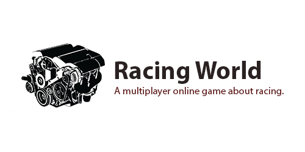

    

# Introduction

Racing world - is a 3D multiplayer online game about racing. At the moment the game
is under development, the full description of the game will be added later.

## Minimum system requirements

    CPU:     Pentium III or AMD K6
    RAM:     100MB
    OpenGL:  Version 3.3
    OS:	 Windows 7, Windows 8, Windows 10
    Store:	 500MB available space
    Network: Broadband Internet connection

## Installation

Full installation guide you can read <a href="./Documentation/INSTALLATION.md">here.</a>

## Contributing

Looking to contribute something to RacingWorld? Please read through our
<a href="./Documentation/CONTRIBUTING.md">contributing guidelines</a> in
order to make the contribution process easy and effective for everyone involved.

## License

Racing world is <a href="./LICENSE">Apache License.</a>

---

If you have any questions, please contact: vladimirbalun@yandex.ru
